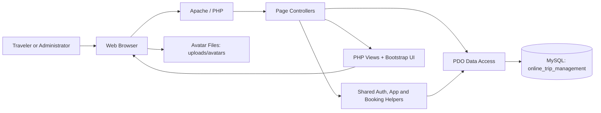
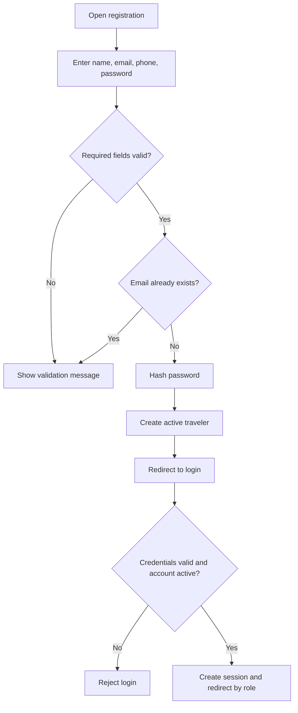
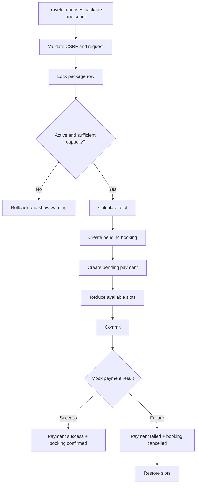
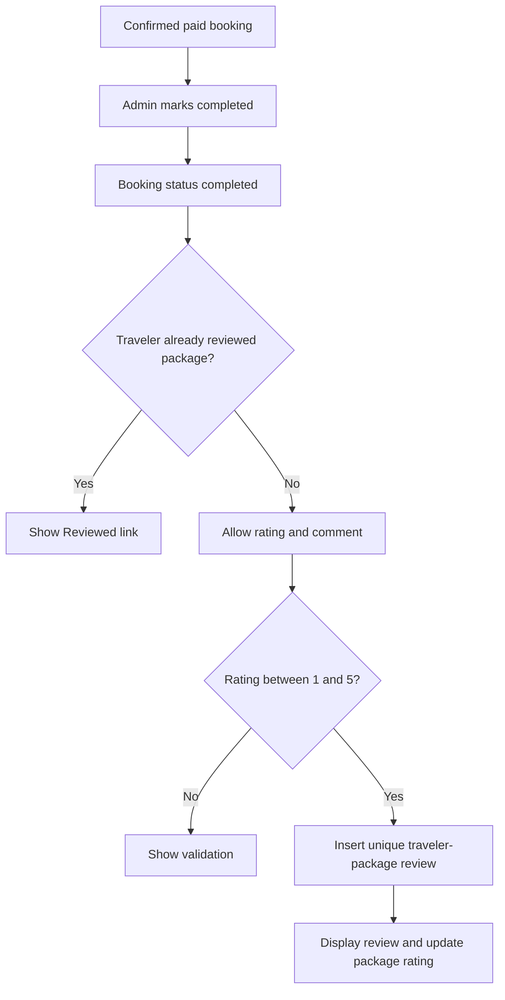
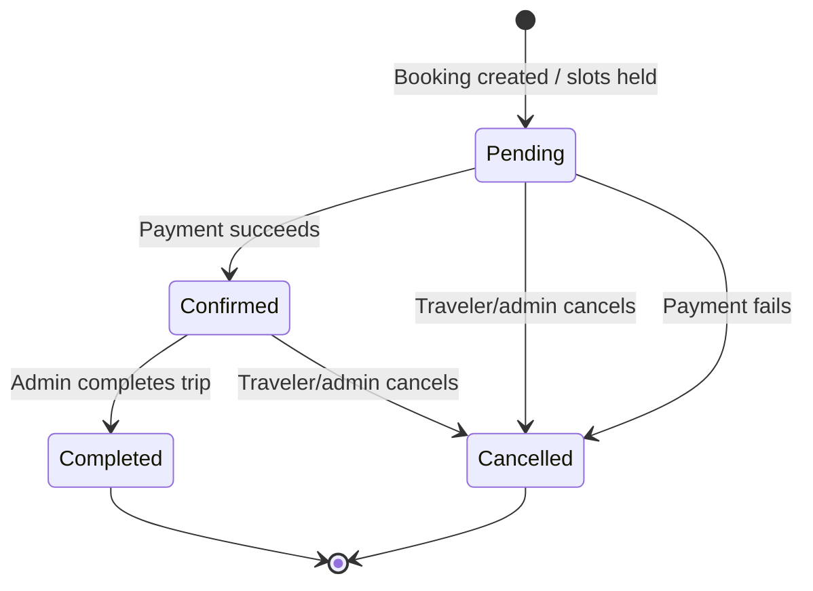
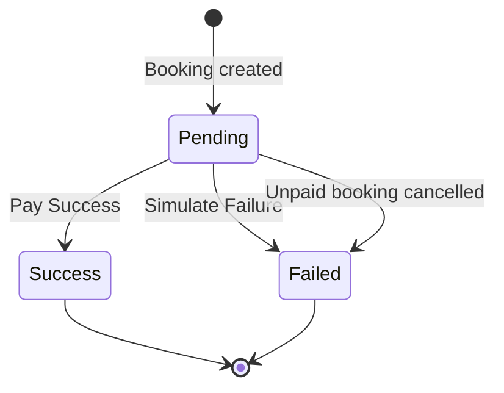
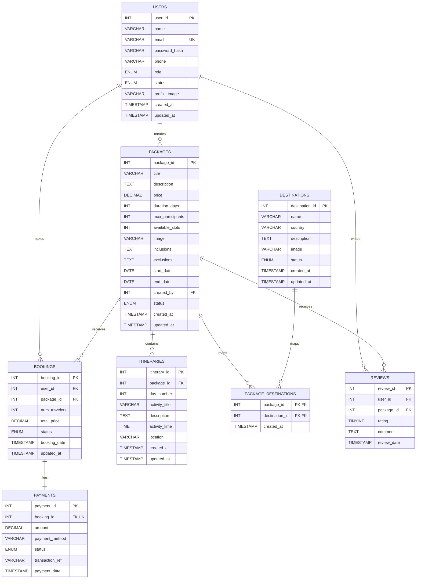
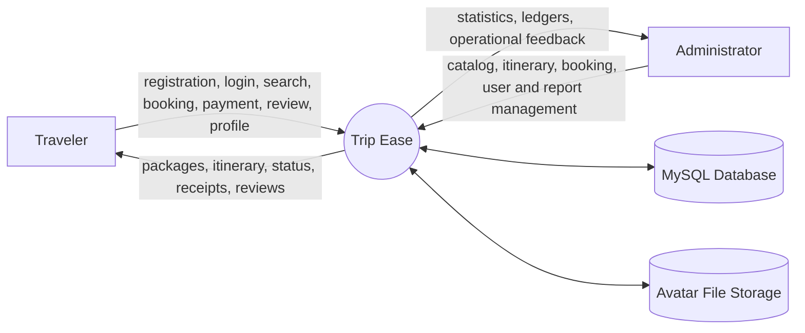
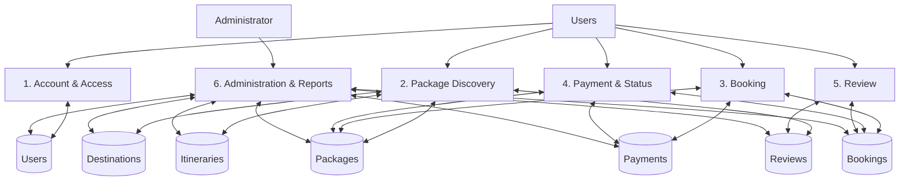

# Trip Ease — Project Summary, Entity and Relationship Report

**Project:** Online Trip Management System  
**Product name:** Trip Ease  
**Domain:** Travel package discovery, booking, sandbox payment, itinerary management, and post-trip reviews  
**Implementation:** PHP 8+, MySQL, PDO, Bootstrap 5, Font Awesome, HTML5, CSS3, JavaScript  
**Deployment target:** XAMPP / Apache / MySQL  
**Database:** `online_trip_management`

---

## 1. Executive Summary

Trip Ease is a web-based online trip management system designed for two user groups: travelers and administrators. Travelers can register, sign in, browse active Sri Lankan tour packages, inspect destinations and day-by-day itineraries, reserve one or more places, complete a mock card payment, monitor booking status, cancel eligible bookings, manage their profile and profile photo, and review completed trips. Administrators operate the platform by maintaining destinations, packages, package-destination mappings, itineraries, bookings, users, roles, availability, payment visibility, and dashboard reports.

The system follows a server-rendered, role-based PHP architecture. Requests are handled by PHP page controllers, data access uses PDO prepared statements, persistent data is stored in MySQL, and Bootstrap provides the responsive interface. Booking creation, payment processing, cancellation, and completion use database transactions where inventory or multiple records must change consistently.

---

## 2. Problem Statement

Travel planning platforms must coordinate package information, destinations, schedules, capacity, reservations, payments, and traveler feedback. Managing these areas separately can lead to inconsistent availability, unclear booking status, payment confusion, and difficult administration.

Trip Ease solves this by providing:

- A single catalog for destinations, packages, dates, pricing, capacity, and itineraries.
- A traveler workspace for booking and payment activity.
- An administrator console for operational control.
- Controlled booking and payment state transitions.
- Capacity holding and restoration rules.
- Post-trip reviews restricted to eligible travelers.
- Dashboard reporting for bookings, revenue, users, packages, and destinations.

---

## 3. Project Objectives

### 3.1 Primary objectives

1. Allow travelers to discover and compare active trip packages.
2. Show package destinations, dates, duration, price, capacity, itinerary, and reviews.
3. Provide a secure authenticated booking flow.
4. Calculate booking totals using package price multiplied by traveler count.
5. Hold package capacity when a booking is created.
6. Provide a sandbox payment flow that confirms or cancels a booking.
7. Allow administrators to complete or cancel eligible bookings.
8. Restore capacity when a held booking is cancelled or its payment fails.
9. Restrict reviews to completed trips and one review per traveler/package pair.
10. Provide role-based dashboards and management tools.

### 3.2 Secondary objectives

- Maintain responsive light and dark themes.
- Provide searchable package and booking views.
- Support traveler profile editing and profile photo uploads.
- Use reusable authentication, authorization, URL, flash-message, CSRF, and booking-service helpers.
- Seed realistic Sri Lankan destinations, packages, bookings, payments, and reviews for demonstration.

---

## 4. Project Scope

### 4.1 Included

- Public landing page.
- Traveler registration and authentication.
- Admin and traveler role authorization.
- Traveler dashboard.
- Package browsing, searching, pagination, details, and itineraries.
- Booking creation and cancellation.
- Mock card payment success/failure simulation.
- Paid-bookings ledger.
- Review creation and display.
- Profile details, password change, and avatar upload/removal.
- Destination management.
- Package management and destination assignment.
- Itinerary item management.
- Booking and payment administration.
- User status and role administration.
- Admin dashboard summaries and reports.

### 4.2 Outside the current scope

- Real payment-gateway integration.
- Email, SMS, or push notifications.
- Refund settlement and accounting reconciliation.
- Multi-currency conversion.
- Hotel, airline, or vehicle-provider integrations.
- Geographic map routing.
- Discount coupons or loyalty points.
- Dedicated audit-log table.
- Password-reset email workflow.
- Fine-grained permissions beyond `traveler` and `admin`.

---

## 5. Stakeholders and User Roles

### 5.1 Traveler

A traveler is the customer-facing user. A traveler can:

- Register and log in.
- View the trip overview dashboard.
- Browse and search active packages.
- View package details, destinations, itinerary, availability, and reviews.
- Create bookings for a valid traveler count.
- Complete mock payment.
- View all bookings and paid bookings.
- Cancel pending or confirmed bookings.
- Review a completed package once.
- Update name, phone number, password, and profile photo.
- Toggle light/dark appearance.

### 5.2 Administrator

An administrator operates the application. An administrator can:

- View operational statistics and revenue.
- Create, edit, activate, and deactivate destinations.
- Create, edit, activate, and deactivate packages.
- Assign multiple destinations to a package.
- Add, edit, and delete itinerary items.
- View and search booking/payment records.
- Filter paid and unpaid bookings.
- Mark confirmed bookings as completed.
- Cancel pending or confirmed bookings.
- Activate/deactivate users and change traveler/admin roles.
- Preview the traveler-facing package catalog.
- Manage their own profile and profile photo.

---

## 6. Functional Requirements

### 6.1 Authentication and account management

- The system shall register public users as active travelers.
- The system shall require unique email addresses.
- The system shall hash passwords using PHP password hashing.
- The system shall authenticate only active accounts.
- The system shall maintain user identity and role in the session.
- The system shall refresh account name, role, status, and avatar from the database.
- The system shall immediately remove access for inactive or missing accounts.
- The system shall allow authenticated users to update their profile.
- The system shall require the current password before setting a new password.
- The system shall accept avatar files in JPG, PNG, WEBP, or GIF format, up to 2 MB.

### 6.2 Package discovery

- The system shall list only active packages in the traveler catalog.
- The catalog shall support title, description, and destination search.
- The catalog shall support pagination.
- A package detail page shall display dates, duration, price, capacity, destinations, itinerary, inclusions/exclusions where available, and review information.
- Administrators shall be able to preview the active catalog.

### 6.3 Booking

- Only travelers may create bookings.
- Booking requests shall use POST and a valid CSRF token.
- The package must exist and be active.
- Traveler count must be greater than zero.
- Traveler count must not exceed package maximum participants.
- Traveler count must not exceed available slots.
- Total price shall equal `package.price × booking.num_travelers`.
- Booking creation shall create both a pending booking and a pending payment.
- Available slots shall be reduced in the same transaction.

### 6.4 Payment

- Each booking shall have exactly one payment record.
- The mock payment form shall require a cardholder name and at least 12 card digits.
- Card details shall not be stored.
- Successful payment shall set payment status to `success`.
- Successful payment shall set booking status to `confirmed`.
- Failed payment shall set payment status to `failed`.
- Failed payment shall cancel the booking and release held slots.
- Transaction references shall be generated for success and failure outcomes.

### 6.5 Booking status management

- A pending or confirmed booking may be cancelled.
- A confirmed booking may be marked completed by an administrator.
- Completed or cancelled bookings shall not be cancelled again.
- Cancelling a booking shall restore held slots.
- Cancelling a booking with a pending payment shall mark the payment failed.
- Traveler cancellation shall verify booking ownership.

### 6.6 Reviews

- Only travelers may submit reviews.
- A traveler must have a completed booking for the package.
- A traveler may review each package only once.
- Rating must be between 1 and 5.
- Reviews shall be visible on the package detail page.

### 6.7 Administration

- Destinations and packages shall support active/inactive status.
- A package shall be assigned to at least one active destination during creation.
- Package creation shall capture title, description, price, duration, capacity, available slots, dates, creator, and status.
- Itinerary items shall be attached to a package and ordered by day/time.
- User management shall support traveler/admin role updates and account activation.
- Booking management shall display traveler, package, total, booking state, payment state, date, and allowed actions.

---

## 7. Non-Functional Requirements

### 7.1 Security

- Passwords are stored as hashes, never as plain text.
- SQL operations use PDO prepared statements.
- Role guards protect traveler and administrator routes.
- Ownership is checked before traveler booking cancellation and payment access.
- CSRF tokens protect critical state-changing forms.
- Dynamic output is escaped with `htmlspecialchars`.
- Uploaded avatars use MIME validation, size limits, generated filenames, and a dedicated folder.
- Database transactions and row locks protect booking inventory changes.

### 7.2 Usability

- Responsive layout for desktop and mobile.
- Consistent sidebar navigation and page headers.
- Flash messages for operation results.
- Light and dark themes saved in browser local storage.
- Clear status badges for booking and payment states.
- Search, pagination, empty states, and action-specific buttons.

### 7.3 Reliability and integrity

- Foreign keys maintain referential integrity.
- Unique constraints prevent duplicate emails, duplicate booking payments, duplicate destination mappings, and duplicate traveler/package reviews.
- Transactions make booking, payment, and slot updates atomic.
- `SELECT ... FOR UPDATE` prevents concurrent slot and booking-status races.

### 7.4 Maintainability

- Shared helpers are stored under `includes/`.
- Shared booking transition logic is centralized in `includes/booking_service.php`.
- Authentication and authorization are centralized in `includes/auth.php`.
- Database access uses a single PDO connection configuration.
- UI styling is centralized in `assets/css/style.css`.

---

## 8. System Architecture

Trip Ease uses a three-layer server-rendered architecture:

1. **Presentation layer**
   - PHP templates, HTML5, Bootstrap 5, Font Awesome, custom CSS, and small JavaScript theme behavior.
   - Shared shell: `includes/header.php` and `includes/footer.php`.

2. **Application layer**
   - Page controllers under `auth/`, `dashboard/`, `trips/`, `bookings/`, `payments/`, `reviews/`, `profile/`, and `admin/`.
   - Shared authentication, authorization, CSRF, flash, URL, avatar, and booking-transition helpers.

3. **Data layer**
   - MySQL database accessed through PHP PDO.
   - Eight normalized tables with primary keys, foreign keys, uniqueness rules, and status constraints.

### 8.1 Architecture diagram

---

## 9. Module and File Report

### 9.1 Common infrastructure

- `config/db.php` — PDO connection to MySQL using UTF-8 and exception mode.
- `includes/app.php` — base URL, redirects, flash messages, status classes, and avatar rendering.
- `includes/auth.php` — sessions, role checks, account refresh, CSRF helpers, and dashboard routing.
- `includes/booking_service.php` — shared cancel/complete booking state transitions.
- `includes/header.php` — public header and authenticated application shell.
- `includes/footer.php` — closing layout, Bootstrap script, and theme toggle behavior.
- `assets/css/style.css` — responsive design and light/dark visual system.

### 9.2 Public authentication

- `index.php` — public landing page and feature overview.
- `auth/register.php` — traveler account creation.
- `auth/login.php` — active-account authentication.
- `auth/logout.php` — session termination.

### 9.3 Traveler workspace

- `dashboard/index.php` — summary statistics, upcoming trips, activity, and booking ledger.
- `trips/list.php` — searchable, paginated active package catalog.
- `trips/view.php` — package, destination, itinerary, availability, and reviews.
- `bookings/create.php` — transactional booking and capacity hold.
- `bookings/my_bookings.php` — booking history and contextual actions.
- `bookings/paid.php` — successfully paid booking ledger.
- `bookings/cancel.php` — owner-validated cancellation.
- `payments/pay.php` — sandbox payment success/failure processing.
- `reviews/create.php` — completed-trip review form.
- `profile/edit.php` — profile, password, and avatar management.

### 9.4 Administrator workspace

- `admin/index.php` — operational statistics, revenue, popular destinations, and top packages.
- `admin/destinations/list.php` — destination listing and status controls.
- `admin/destinations/edit.php` — destination create/edit form.
- `admin/destinations/toggle_status.php` — destination activation/deactivation.
- `admin/packages/list.php` — package inventory.
- `admin/packages/create.php` — package and destination mapping creation.
- `admin/packages/edit.php` — package and destination mapping updates.
- `admin/packages/toggle_status.php` — package activation/deactivation.
- `admin/itineraries/manage.php` — itinerary item CRUD.
- `admin/bookings/list.php` — searchable and filterable booking/payment ledger.
- `admin/bookings/update_status.php` — complete/cancel workflow.
- `admin/users/list.php` — user and role listing.
- `admin/users/update_role.php` — role update.
- `admin/users/toggle_status.php` — user activation/deactivation.

---

## 10. Main Process Workflows

### 10.1 Registration and login

### 10.2 Booking and payment

### 10.3 Completion and review

### 10.4 Booking state model

### 10.5 Payment state model

---

## 11. Database Overview

The database contains eight active tables:

1. `users`
2. `destinations`
3. `packages`
4. `package_destinations`
5. `itineraries`
6. `bookings`
7. `payments`
8. `reviews`

The model is normalized around users, catalog data, package composition, transactions, and feedback.

---

## 12. Entity Report / Data Dictionary

### 12.1 `users`

**Purpose:** Stores traveler and administrator accounts.

| Attribute | Type | Rules | Description |
|---|---|---|---|
| `user_id` | INT | PK, AUTO_INCREMENT | Account identifier |
| `name` | VARCHAR(100) | NOT NULL | Full display name |
| `email` | VARCHAR(150) | NOT NULL, UNIQUE | Login email |
| `password_hash` | VARCHAR(255) | NOT NULL | Password hash |
| `phone` | VARCHAR(20) | NULL | Contact number |
| `role` | ENUM | NOT NULL, default `traveler` | `traveler` or `admin` |
| `status` | ENUM | NOT NULL, default `active` | `active` or `inactive` |
| `profile_image` | VARCHAR(255) | NULL | Generated avatar filename |
| `created_at` | TIMESTAMP | default CURRENT_TIMESTAMP | Creation time |
| `updated_at` | TIMESTAMP | auto-update | Last modification time |

### 12.2 `destinations`

**Purpose:** Stores locations that can be assigned to packages.

| Attribute | Type | Rules | Description |
|---|---|---|---|
| `destination_id` | INT | PK, AUTO_INCREMENT | Destination identifier |
| `name` | VARCHAR(120) | NOT NULL | Destination name |
| `country` | VARCHAR(120) | NOT NULL | Country name |
| `description` | TEXT | NULL | Destination description |
| `image` | VARCHAR(255) | NULL | Optional image reference |
| `status` | ENUM | NOT NULL, default `active` | `active` or `inactive` |
| `created_at` | TIMESTAMP | default CURRENT_TIMESTAMP | Creation time |
| `updated_at` | TIMESTAMP | auto-update | Last modification time |

### 12.3 `packages`

**Purpose:** Stores sellable travel packages and capacity.

| Attribute | Type | Rules | Description |
|---|---|---|---|
| `package_id` | INT | PK, AUTO_INCREMENT | Package identifier |
| `title` | VARCHAR(180) | NOT NULL | Package name |
| `description` | TEXT | NOT NULL | Main description |
| `price` | DECIMAL(10,2) | NOT NULL, default 0.00 | Price per traveler |
| `duration_days` | INT | NOT NULL | Package duration |
| `max_participants` | INT | NOT NULL, default 1 | Per-booking/package limit |
| `available_slots` | INT | NOT NULL, default 1 | Current bookable capacity |
| `image` | VARCHAR(255) | NULL | Optional image reference |
| `inclusions` | TEXT | NULL | Included services |
| `exclusions` | TEXT | NULL | Excluded services |
| `start_date` | DATE | NULL | Trip start |
| `end_date` | DATE | NULL | Trip end |
| `created_by` | INT | FK → `users.user_id`, NOT NULL | Administrator creator |
| `status` | ENUM | NOT NULL, default `active` | `active` or `inactive` |
| `created_at` | TIMESTAMP | default CURRENT_TIMESTAMP | Creation time |
| `updated_at` | TIMESTAMP | auto-update | Last modification time |

### 12.4 `package_destinations`

**Purpose:** Resolves the many-to-many relationship between packages and destinations.

| Attribute | Type | Rules | Description |
|---|---|---|---|
| `package_id` | INT | Composite PK, FK → `packages.package_id` | Package |
| `destination_id` | INT | Composite PK, FK → `destinations.destination_id` | Destination |
| `created_at` | TIMESTAMP | default CURRENT_TIMESTAMP | Mapping creation time |

Deleting a package or destination cascades to its mapping rows.

### 12.5 `itineraries`

**Purpose:** Stores ordered daily activities for packages.

| Attribute | Type | Rules | Description |
|---|---|---|---|
| `itinerary_id` | INT | PK, AUTO_INCREMENT | Itinerary item identifier |
| `package_id` | INT | FK → `packages.package_id`, NOT NULL | Parent package |
| `day_number` | INT | NOT NULL | Day sequence |
| `activity_title` | VARCHAR(180) | NOT NULL | Activity name |
| `description` | TEXT | NULL | Activity details |
| `activity_time` | TIME | NULL | Scheduled time |
| `location` | VARCHAR(180) | NULL | Activity location |
| `created_at` | TIMESTAMP | default CURRENT_TIMESTAMP | Creation time |
| `updated_at` | TIMESTAMP | auto-update | Last modification time |

Deleting a package cascades to its itinerary rows.

### 12.6 `bookings`

**Purpose:** Stores traveler reservations and immutable booking totals.

| Attribute | Type | Rules | Description |
|---|---|---|---|
| `booking_id` | INT | PK, AUTO_INCREMENT | Booking identifier |
| `user_id` | INT | FK → `users.user_id`, NOT NULL | Booking traveler |
| `package_id` | INT | FK → `packages.package_id`, NOT NULL | Reserved package |
| `num_travelers` | INT | NOT NULL, default 1 | Reserved people |
| `total_price` | DECIMAL(10,2) | NOT NULL, default 0.00 | Price captured at booking |
| `status` | ENUM | NOT NULL, default `pending` | `pending`, `confirmed`, `completed`, `cancelled` |
| `booking_date` | TIMESTAMP | default CURRENT_TIMESTAMP | Booking creation |
| `updated_at` | TIMESTAMP | auto-update | Last state change |

User and package deletion is restricted when bookings reference them.

### 12.7 `payments`

**Purpose:** Stores one sandbox payment lifecycle per booking.

| Attribute | Type | Rules | Description |
|---|---|---|---|
| `payment_id` | INT | PK, AUTO_INCREMENT | Payment identifier |
| `booking_id` | INT | FK → `bookings.booking_id`, NOT NULL, UNIQUE | Exactly one payment per booking |
| `amount` | DECIMAL(10,2) | NOT NULL | Payment amount |
| `payment_method` | VARCHAR(50) | NOT NULL | Current value: `mock_card` |
| `status` | ENUM | NOT NULL, default `pending` | `success`, `failed`, `pending` |
| `transaction_ref` | VARCHAR(120) | NULL | Generated transaction reference |
| `payment_date` | TIMESTAMP | default CURRENT_TIMESTAMP | Payment row time |

Booking deletion is restricted while payment data references it.

### 12.8 `reviews`

**Purpose:** Stores traveler feedback for completed package experiences.

| Attribute | Type | Rules | Description |
|---|---|---|---|
| `review_id` | INT | PK, AUTO_INCREMENT | Review identifier |
| `user_id` | INT | FK → `users.user_id`, NOT NULL | Reviewer |
| `package_id` | INT | FK → `packages.package_id`, NOT NULL | Reviewed package |
| `rating` | TINYINT | NOT NULL, CHECK 1–5 | Star rating |
| `comment` | TEXT | NULL | Written feedback |
| `review_date` | TIMESTAMP | default CURRENT_TIMESTAMP | Submission time |

`UNIQUE(user_id, package_id)` permits one review per traveler/package pair.

---

## 13. Entity Relationships and Cardinalities

| Parent entity | Relationship | Child entity | Cardinality | Implementation |
|---|---|---|---|---|
| `users` | creates | `packages` | 1 : many | `packages.created_by` |
| `users` | makes | `bookings` | 1 : many | `bookings.user_id` |
| `packages` | receives | `bookings` | 1 : many | `bookings.package_id` |
| `packages` | contains | `itineraries` | 1 : many | `itineraries.package_id` |
| `packages` | visits | `destinations` | many : many | `package_destinations` |
| `bookings` | has | `payments` | 1 : 1 | unique `payments.booking_id` |
| `users` | writes | `reviews` | 1 : many | `reviews.user_id` |
| `packages` | receives | `reviews` | 1 : many | `reviews.package_id` |

### 13.1 Important semantic relationship

A review is linked to a user and package, not directly to a booking. Application logic verifies that the same user has at least one completed booking for that package before inserting the review.

---

## 14. Complete ER Diagram Schema

---

## 15. Referential Actions and Integrity Rules

- `packages.created_by → users.user_id`: `ON DELETE RESTRICT`.
- `package_destinations.package_id → packages.package_id`: `ON DELETE CASCADE`.
- `package_destinations.destination_id → destinations.destination_id`: `ON DELETE CASCADE`.
- `itineraries.package_id → packages.package_id`: `ON DELETE CASCADE`.
- `bookings.user_id → users.user_id`: `ON DELETE RESTRICT`.
- `bookings.package_id → packages.package_id`: `ON DELETE RESTRICT`.
- `payments.booking_id → bookings.booking_id`: `ON DELETE RESTRICT`.
- `reviews.user_id → users.user_id`: `ON DELETE RESTRICT`.
- `reviews.package_id → packages.package_id`: `ON DELETE RESTRICT`.
- `users.email` is unique.
- `package_destinations(package_id, destination_id)` is a composite primary key.
- `payments.booking_id` is unique.
- `reviews(user_id, package_id)` is unique.
- `reviews.rating` is constrained to 1–5.

---

## 16. Business Rules

1. Public registration always creates an active traveler.
2. Only active accounts may authenticate.
3. Only administrators may use admin management routes.
4. Only travelers may create bookings, pay, cancel their bookings, or submit reviews.
5. A package must be active and have enough slots before booking.
6. Traveler count must be positive and not exceed `max_participants`.
7. Booking total is captured at booking time.
8. Capacity is held immediately when the booking is created.
9. Payment success confirms the booking without deducting slots a second time.
10. Payment failure cancels the booking and restores slots.
11. Pending or confirmed bookings can be cancelled.
12. Only confirmed bookings can become completed.
13. A completed booking enables review eligibility.
14. A traveler can review a package only once.
15. Deactivating a package removes it from the active catalog without deleting historical records.
16. Deactivating a user prevents future authenticated access.

---

## 17. Data Flow Diagram (Level 0)

---

## 18. Data Flow Diagram (Level 1)

---

## 19. Use Case Summary

### Traveler use cases

- Create account.
- Log in/log out.
- Open dashboard.
- Search and browse packages.
- View package and itinerary.
- Create booking.
- Complete/fail mock payment.
- View all or paid bookings.
- Cancel eligible booking.
- Submit/view review.
- Update account/password/avatar.

### Administrator use cases

- Log in/log out.
- View administrative dashboard.
- Manage destinations.
- Manage packages and package destinations.
- Manage itinerary items.
- Search/filter bookings.
- View payments and transaction references.
- Complete/cancel bookings.
- Manage account roles/status.
- Preview active catalog.
- Update own profile/avatar.

---

## 20. User Interface Structure

### Traveler navigation

1. Dashboard
2. Browse Packages
3. My Bookings
4. Paid Bookings
5. Profile
6. New Booking action

### Administrator navigation

1. Dashboard
2. Destinations
3. Packages
4. Bookings
5. Paid Bookings
6. Users & Roles
7. Preview Site
8. Profile
9. New Package action

---

## 21. Seed and Demonstration Data

The SQL script provides:

- One administrator: `admin@tripease.local`.
- One traveler: `traveler@tripease.local`.
- Six Sri Lankan destinations: Kandy, Ella, Sigiriya, Nuwara Eliya, Galle, and Mirissa.
- Four packages:
  - Hill Country Tea Trail.
  - Cultural Triangle Heritage Tour.
  - Southern Coast Escape.
  - Ella Highlands Adventure.
- Package-destination mappings.
- Twenty itinerary activities.
- Two demonstration bookings.
- Two successful mock payments.
- One completed-trip review.

---

## 22. Testing Strategy

### 22.1 Authentication tests

- Register a valid traveler.
- Reject duplicate email.
- Reject invalid credentials.
- Reject inactive account.
- Verify traveler/admin route separation.

### 22.2 Catalog tests

- List active packages only.
- Search by title and destination.
- Verify pagination.
- Verify details and itinerary ordering.
- Verify inactive packages cannot be booked.

### 22.3 Booking tests

- Create booking within capacity.
- Reject zero/negative traveler count.
- Reject count above available slots.
- Reject count above maximum participants.
- Confirm correct total calculation.
- Verify booking/payment rows and slot deduction occur atomically.

### 22.4 Payment tests

- Confirm successful payment transitions.
- Confirm failed payment transitions and slot restoration.
- Reject access to another traveler’s payment.
- Reject reprocessing a non-pending payment.
- Verify card data is not persisted.

### 22.5 Status and cancellation tests

- Cancel pending booking.
- Cancel confirmed booking.
- Reject cancellation of completed/cancelled booking.
- Complete confirmed booking.
- Reject completion of pending booking.
- Verify slots restore exactly once.

### 22.6 Review tests

- Allow completed-trip review.
- Reject review without completed booking.
- Reject second review for same traveler/package.
- Reject rating outside 1–5.
- Verify rating aggregation on package display.

### 22.7 Profile tests

- Update name and phone.
- Reject short password.
- Require correct current password.
- Upload each supported image type.
- Reject unsupported or oversized image.
- Replace and remove avatar.

---

## 23. Current Limitations and Improvement Opportunities

1. Payment is a sandbox simulation; integrate a real provider for production.
2. Some administrative forms should consistently apply CSRF protection if not already covered.
3. Registration should enforce explicit minimum password length server-side.
4. Add database `CHECK` constraints for positive prices, capacities, traveler counts, and valid date order.
5. Add a uniqueness rule such as `(package_id, day_number, activity_time)` if duplicate itinerary slots are not desired.
6. Store review eligibility against a specific booking if multiple completed bookings for the same package must be distinguished.
7. Add payment `updated_at`, refund state, and refund transaction records for production accounting.
8. Add an audit log for role, status, booking, and catalog changes.
9. Add file-content processing/resizing for avatars and disable script execution in upload directories.
10. Replace detailed database connection errors with a generic production-safe message.
11. Add automated integration and browser tests.
12. Add notification and password-reset workflows.

---

## 24. Future Enhancements

- Real payment gateway and refunds.
- Email/SMS booking confirmations.
- Promo codes and seasonal pricing.
- Package wishlists and saved searches.
- Multi-currency and localization.
- Map-based destination browsing.
- Downloadable invoices and travel documents.
- Admin audit trail.
- Analytics charts and date-range reporting.
- Vendor, guide, hotel, and transport modules.
- Automated trip completion based on end date.
- Review moderation and traveler image galleries.

---

## 25. Installation and Execution

1. Copy the project into the XAMPP `htdocs` directory.
2. Start Apache and MySQL.
3. Import `database.sql` in phpMyAdmin.
4. Confirm connection values in `config/db.php`.
5. Open `http://localhost/online_trip_managemet_system/`.

Default demonstration accounts:

- Administrator: `admin@tripease.local` / `admin123`
- Traveler: `traveler@tripease.local` / `traveler123`

---

## 26. Conclusion

Trip Ease demonstrates a complete two-role trip-management workflow using PHP and MySQL. Its strongest design areas are its clear traveler/admin separation, normalized relational model, one-to-one booking/payment design, explicit booking status lifecycle, transactional capacity handling, review eligibility rules, responsive dashboard interface, and realistic Sri Lankan seed data. The system is suitable as an academic project, portfolio application, or foundation for a production travel platform after hardening payments, validation, auditing, notifications, and automated testing.

---

## 27. Glossary

- **Traveler:** Customer who browses, books, pays, and reviews.
- **Administrator:** Platform operator with management privileges.
- **Package:** A priced, dated travel product.
- **Destination:** A location associated with one or more packages.
- **Itinerary:** Ordered package activities grouped by day.
- **Booking:** A traveler reservation for a package.
- **Payment:** One sandbox transaction record linked to a booking.
- **Review:** Rating and comment submitted after trip completion.
- **Capacity hold:** Immediate reduction of available slots when a booking is created.
- **CSRF:** Protection against unauthorized cross-site form submissions.
- **PDO:** PHP Data Objects database access API.

